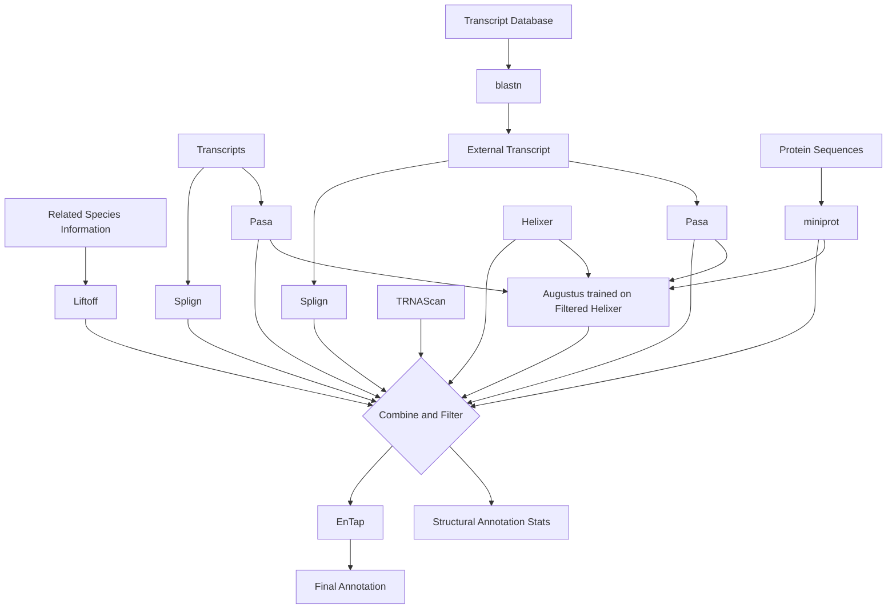
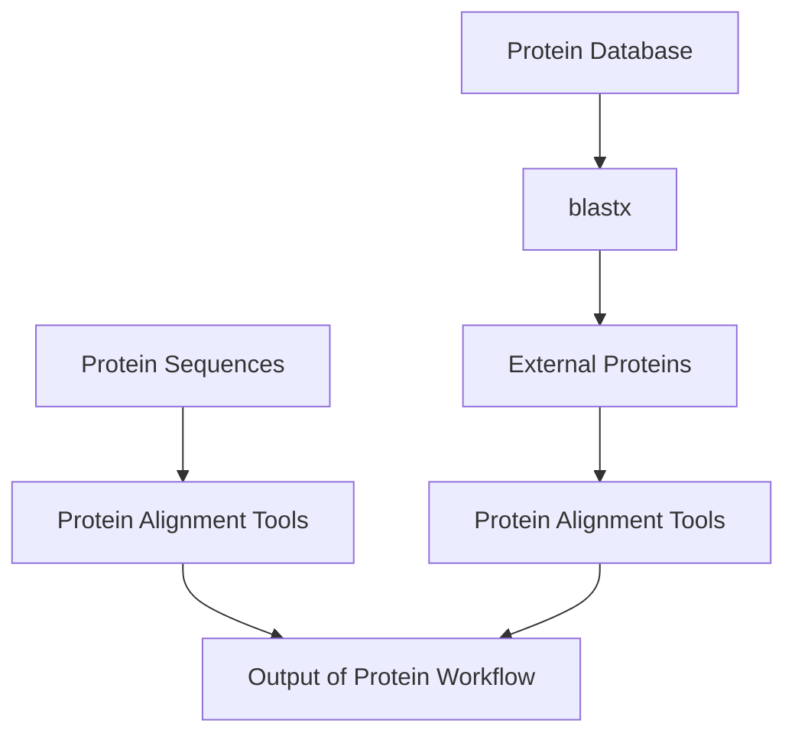
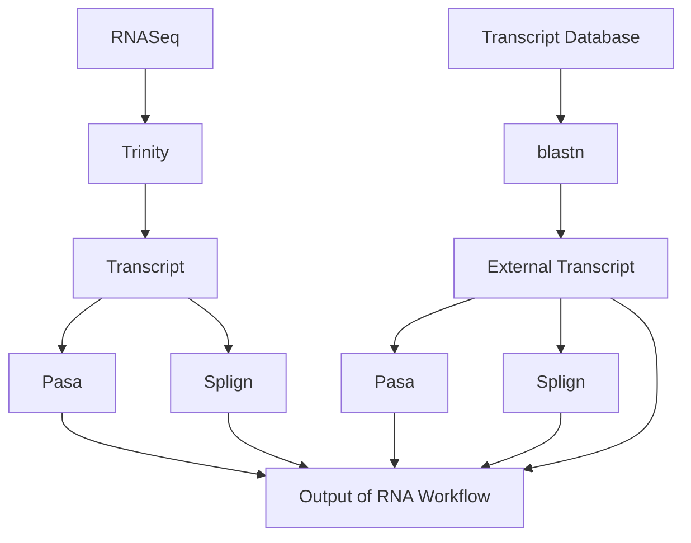
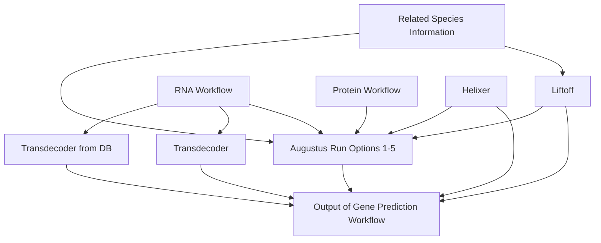
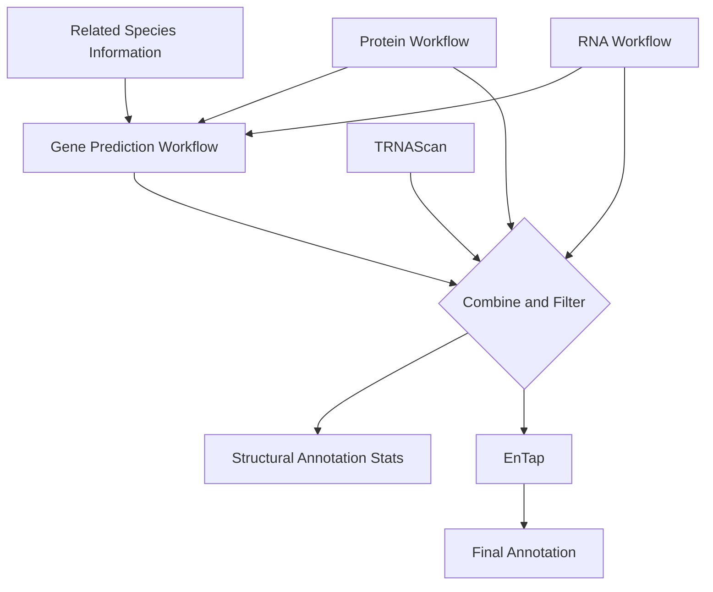

# FLAG (Find Label Annotate Genes)
This is the public repository for FLAG, the Form Bio Genome Annotation Workflow.

## Run options:
The official release of FLAG supports running in either GCP (Google Cloud Platform) or locally, default is local. If running on GCP switch out the modules/nf-modules/nfconf/base.config with modules/nf-modules/nfconf/gcp.config.

This nextflow workflow can also be run on the Form Bio Platform which has it already setup and able to run in parallel on the cloud along with an easy to run user interface and precurated rna and protein databases for users. In testing average run costs for bird genomes were around $80 and mammals were around $250. However, this is subject to change and largely dependant on input data sizes.

## Necessary installs:
1. Docker
2. Nextflow

## Summary

Genome annotation uses computational algorithms to predict the locations
of potential genes and tRNAs, this is called structural annotation. Once
locations are found they are functionally annotated by labeling with
commonly used gene names such as KRT8 and KRAS.

The longest part of this is done in several parallel steps including RNA
transcript to genome alignment, protein to genome alignment, and gene
prediction. Once These parts are done the predicted genes and alignments
are then combined to form a consensus structural annotation. This
structural annotation is then formatted uniformly to be similar to that
of the NCBI and then functionally annotated with Entap.

## Run Parameteres:
Currently available run parameters (and descriptions) include: 
--genome (REQUIRED. This is the genome assembly fasta file you are annotating)

--masker (REQUIRED. Default is skip. This is used to signify if masking of the genome has been done yet, if it has then skip should be selected. If no masking has been done there are multiple masking options that can be run. Details on masking are in the masker section below)

--lineage (REQUIRED. This is a odb10 BUSCO lineage and needs to be input as such. An example input for this param is mammalia_odb10. All available lineages can be found on the lineage section below. It is good to pick a lineage that is as specific as possible to your species of interest)

--annotationalgo (REQUIRED. A list of gene prediction algorithms you wish to use in your run, without spaces. The default of this is Helixer,helixer_trained_augustus,Liftoff. More options can be found below in the annotationalgo section)

--helixerModel (REQUIRED IF annotationalgo HAS HELIXER. This is the Helixer model to use in your run. Available options for this include vertebrate, invertebrate, land_plant, and fungi)

--protein (HIGHLY RECOMMENDED. This is a protein fasta file of the species you are annotating or of related species, for most cases in testing 1-3 related species proteome fasta files were combined into a singular fasta file and input for this parameter. However, more proteomes can be added but with diminishing results and increased compute time)

--rna (HIGHLY RECOMMENDED. This is a rna or transcript fasta file of the species you are annotating or of related species, for most cases in testing 1-3 related species transcripts were combined into a singular fasta file and input for this parameter. However, more transcripts can be added but with diminishing results and increased compute time. This parameter can also take in rna reads in fasta format but it is recommended to use transcripts over raw reads if available as making transcripts with trinity can make the workflow take much longer)

--transcriptIn (REQUIRED IF USING --rna. Acceptable inputs are true or false. true if your rna file is comprised solely of transcripts. false if you rna file is comprised solely of raw rnaseq reads. Combinations of the two are not currently supported)

--fafile (RECOMMENDED. This is a genome assembly of a closely related species for use in liftoff. Currently only 1 is supported per run. If liftoff is not desired to be run this param can be ignored. However, liftoff runs very fast and there are already a lot of public annotations so for most cases this parameter is recommended unless there is just nothing publicly available that is similar to your species of interest)

--gtffile (REQUIRED IF USING --fafile. This is the annotation of the related species genome assembly for use in liftoff. Currently only 1 is supported per run and has to be the annotation of the fafile provided. If no file is provided to --fafile this param can be ignored)

--externalalgo (REQUIRED IF USING --protein OR --rna. This parameter is required to properly use you input protein or rna files, no spaces allowed. If using rna AND protein files this should be set to input_transcript,input_proteins. To only use rna then input_transcript. To only use proteins then input_proteins. Note this can also signify to use external databases such as with transcript_from_database or proteins_from_database. However, the database feature if only partially supported outside of the Form Bio platform at this time. This may change in the future though as much of the code to support it is in the repo and only database paths must be changed)

--size (REQUIRED. Size affects how filtering is done. Current options are small and normal. For most cases normal should be used. However, if your complete genome assembly of interest is less than ~750 Mb or the predicted average protein-coding gene size less than 10,000 then small will most likely produce better outputs. For most eukaryotes this is just bugs, some plants, and possibly some amphibians)

--proteinalgo (REQUIRED IF USING --protein. This is your selection of a genome to protein alignment algorithm or algorithms. It is recommended to only ever use miniprot as it is much faster than others and provides good results. However, a full list of available options is in the proteinalgo section below)

--speciesScientificName (REQUIRED. This is the scientific name of your species separated by an underscore. For example Eynnis tages should be input as Eynnis_tages. This is used for gene id labeling in your output annotation)

--databaseid (This option is not currently fully supported in the open source version of flag however all code to support it is in the repo and just paths need to be modified. This is for running FLAG with external protein databases)

--rnadatabaseid (This option is not currently fully supported in the open source version of flag however all code to support it is in the repo and just paths need to be modified. This is for running FLAG with external transcript databases)

## Example Run commands
Within the repo all example files from the paper for Erynnis tages are provided, except for the genome assembly which can be downloaded from https://ftp.ensembl.org/pub/rapid-release/species/Erynnis_tages/GCA_905147235.1/braker/genome/Erynnis_tages-GCA_905147235.1-softmasked.fa.gz. Note an EnTap database must still be made.

After making the EnTap database and uncompressing the example run files in the example folder one can annotate Eynnis tages with the following run command without Liftoff:
nextflow run -w workdir/ --output outputdir/ --genome GCA_905147235.1_ilEryTage1.1_genomic.fa --rna curatedButterflyRNA.fa --proteins curatedButterflyProteins.fa --masker skip --transcriptIn true --lineage lepidoptera_odb10 --annotationalgo Helixer,helixer_trained_augustus --helixerModel invertebrate --externalalgo input_transcript,input_proteins,transcript_from_database --size small --proteinalgo miniprot --rnadatabaseid refseq_select_rna --speciesScientificName Eynnis_tages

If Liftoff is desired the above command can be modified such as below:
nextflow run -w workdir/ --output outputdir/ --genome GCA_905147235.1_ilEryTage1.1_genomic.fa --rna curatedButterflyRNA.fa --proteins curatedButterflyProteins.fa --masker skip --transcriptIn true --lineage lepidoptera_odb10 --annotationalgo Helixer,helixer_trained_augustus --helixerModel invertebrate --externalalgo input_transcript,input_proteins,transcript_from_database --size small --proteinalgo miniprot --rnadatabaseid refseq_select_rna --speciesScientificName Eynnis_tages --fafile monarchGenome.fa --gtffile monarchAnnotation.gff3


## Extra Info on Parameters:
### genome
Must be an uncompressed fasta file with a .fasta or .fa extension.

### masker
This param is used to perform softmasking on your genome assembly. All input assemblies should already be softmasked at time of input or be softmasked within FLAG. If already softmasked at time of input then skip should be input for this parameter. If not the assembly needs to be softmasked within FLAG. Available softmasking options within FLAG are: WindowMasker, RepeatMasker, and RepeatMasker_with_RepeatModeler. 
WindowMaskers runs very fast and has comparable results to RepeatMasker. Run time a couple hours for mammals.
RepeatMasker is still fast, although not as fast and WindowMasker, and is a good general masking tool.
RepeatMasker_with_RepeatModeler runs RepeatMasker, followed by RepeatModeler to generate a repeat library, before being input back into RepeatMasker with the generated repeat library. Some may consider this the most accurate masking technique however the run time is much slower than the other options. Within Flag though this option is highly parallelized and on multiple tested mammals ran for 1.5-2 days.

### protein
Must be an uncompressed fasta file with a .fasta or .fa extension.

### rna
Must be an uncompressed fasta file with a .fasta or .fa extension.

### fafile
Must be an uncompressed fasta file with a .fasta or .fa extension.

### gtffile
Must be an uncompressed fasta file with a .gtf, .gff, or gff3 extension. NCBI formatted gff3 is the preferred to reduce errors in parsing with liftoff and for later steps however gtf is supported.

### proteinalgo
Default is miniprot
Other available options are: genomethreader, prosplign, and exonerate
Extra details: Protein to genome alignment is very computationally expensive. It is recommended to only select 1. In most cases miniprot gives the best results although exonerate and genomethreader can also perform well. We generally do not recommend prosplign.

### lineage
We provide an exhaustive list of currently available BUSCO lineages:
eukaryota_odb10, alveolata_odb10, apicomplexa_odb10, aconoidasida_odb10, plasmodium_odb10, coccidia_odb10, euglenozoa_odb10, fungi_odb10, ascomycota_odb10, dothideomycetes_odb10, capnodiales_odb10, pleosporales_odb10, eurotiomycetes_odb10, chaetothyriales_odb10, eurotiales_odb10, onygenales_odb10, leotiomycetes_odb10, helotiales_odb10, saccharomycetes_odb10, sordariomycetes_odb10, glomerellales_odb10, hypocreales_odb10, basidiomycota_odb10, agaricomycetes_odb10, agaricales_odb10, boletales_odb10, polyporales_odb10, tremellomycetes_odb10, microsporidia_odb10, mucoromycota_odb10, mucorales_odb10, metazoa_odb10, arthropoda_odb10, arachnida_odb10, insecta_odb10, endopterygota_odb10, diptera_odb10, hymenoptera_odb10, lepidoptera_odb10, hemiptera_odb10, mollusca_odb10, nematoda_odb10, vertebrata_odb10, actinopterygii_odb10, cyprinodontiformes_odb10, tetrapoda_odb10, mammalia_odb10, eutheria_odb10, euarchontoglires_odb10, glires_odb10, primates_odb10, laurasiatheria_odb10, carnivora_odb10, cetartiodactyla_odb10, sauropsida_odb10, aves_odb10, passeriformes_odb10, stramenopiles_odb10, viridiplantae_odb10, chlorophyta_odb10, embryophyta_odb10, liliopsida_odb10, poales_odb10, eudicots_odb10, brassicales_odb10, fabales_odb10, solanales_odb10

### annotationalgo
A list of all available annotationalgo options, note some of the Augustus options are dependant on other options if they use another program output to train on: Helixer, denovo_augustus, related_species_augustus, augustus_pretrained, Liftoff, helixer_trained_augustus, liftoff_trained_augustus, transdecoder


## Extra Info on Programs:
### Liftoff
Currently only 1 liftoff run per workflow run is supported. It is recommended to use a high quality genome annotation of a closely related species. For extra details say you have 2 closely related species. Species X is very slightly more related to your species of interest however its annotation is of poor quality where as species Y has a great quality annotation but is just very slightly less related to your species of interest than X. It would be recommended to use species Y for Liftoff instead of species X. 
We also note that at the time of writing Liftoff has a tendancy to overpredict single exon genes. However, Liftoff predictions are still very good and run very fast so it is almost always recommended to run Liftoff.

### Augustus
Although we run Augustus here in parallel for each scaffold in the assembly it can still take quite awhile to train and run, for helixer trained augustus this can be 1.5 to 2 days for mammals. For denovo trained augustus this can take over a week. 
For most cases if a user wants to run Augustus helixer trained augustus is the best option. Liftoff trained Augustus provides similar results though as Helixer Trained. 
In testing if a user has a high quality genome assembly and is already running Helixer and Liftoff then Augustus can be skipped without really effecting the end annotation and cutting the total run time roughly in half.

### Transdecoder
At this current time we do not recommend Transdecoder be run in FLAG but it is still supported for users that desire it.

## Extra Info on Output Files:
During the run multiple output folders and files will be produced within your given output directory. The following are the most important:
StructuralAnnotation/FinalStructuralAnnotationLenientFilter.gtf this is your desired structural annotation without formatting or functional annotations.

StructuralAnnotation/FinalStructuralAnnotationLenientFilter.gtf this is your desired structural annotation with extra filters without formatting or functional annotations. However for almost all cases this file should be ignored as these filters are still being adjusted and currently heavily over filter.

StructuralAnnotation/FinalStructuralAnnotation*.gff3.stats AGAT statistics on your output annotation

StructuralAnnotation/short_summary.specific.*.buscooutLenient.txt BUSCO scores of the annotation

finalAnnots/*.gtf FINAL ANNOTATION with functional annotations added. This is the end output file.

## Databases
### Instructions on how to build the Entap database
Your Entap database must contain 5 files in order to be in alignment with our Entap Configuration file used in FLAG:
eggnog.db             entap_database.bin  uniprot_sprot.dmnd
eggnog_proteins.dmnd  entap_database.db

The Entap official instructions for building this can be found here: https://entap.readthedocs.io/en/v0.9.1-beta/basic_usage.html#usage-preparing-your-reference-databases

For ease of use we simplify this process and confirm it is working as of August 11, 2023:
1. Enter the flag_entap docker container:
    ``` code
    docker run -it flag_entap:latest
    ```
2. Download the required files that will be configured:
    ``` code
    wget http://eggnog5.embl.de/download/eggnog_4.1/eggnog-mapper-data/eggnog4.clustered_proteins.fa.gz
    wget http://eggnog6.embl.de/download/emapperdb-5.0.2/eggnog.db.gz
    wget https://treegenesdb.org/FTP/EnTAP/latest/databases/entap_database.bin.gz
    wget https://treegenesdb.org/FTP/EnTAP/latest/databases/entap_database.db.gz
    mv FLAG/databases/uniprot_sprot.dmnd.gz .
    ```
3. Unzip all databases
    ``` code
    gunzip *
    ```
4. Format the eggnog_proteins database:
    ``` code
    EnTAP --config -d eggnog4.clustered_proteins.fa --out-dir makedbs -t $threads --ini /opt/EnTAP/entap_config.ini
    mv makedbs/bin/eggnog4.dmnd eggnog_proteins.dmnd
    ```
5. Deposit all Entap DBs into a folder and tar it
    ``` code
    mkdir entapDBs
    mv uniprot_sprot.dmnd entapDBs/
    mv eggnog_proteins.dmnd entapDBs/
    mv eggnog.db entapDBs/
    mv entap_database.bin entapDBs/
    mv entap_database.db entapDBs/
    tar czf entapDBs.tar.gz entapDBs/
    ```
6. Transfer your entapDBs.tar.gz out of the container to somewhere you can use it in your run. The total file size should be around 6.5 Gb

## Workflow Diagram

The default workflow diagram of FLAG. As the input genome goes into all
steps shown here, except for Trinity, it is left out of the workflow
diagram as to reduce clutter.



To make it easier to understand this workflow can be broken up into 4
smaller workflows:

### 1. Protein Workflow



### 2. RNA Workflow



### 3. Gene Prediction Workflow



### 4. Overall



## Methods

First if the input genome is unmasked then masking is done with
windowmasker<sup><sup>[1](#ref-morgulisWindowMaskerWindowbasedMasker2006)</sup></sup>,
repeat
masker<sup><sup>[2](#ref-hubleyRmhubleyRepeatMasker2023)</sup></sup>, or
repeat
modeler<sup><sup>[3](#ref-flynnRepeatModeler2AutomatedGenomic2020)</sup></sup>
in conjunction with repeat masker. Then proteins and transcript data are
aligned to the genome in parallel, extra protein or transcript data can
also be pulled from databases at this time with blast. Depending on what
gene predictors are selected gene prediction will be run in parallel or
in series with protein and transcript alignments. After all alignments
and gene predictions are done they are then combined and filtered down
to produce more complete consensus gene predictions and filter out
unlikely predictions. The protein coding annotations are also combined
with tRNA annotations from tRNAScan. Once all annotations are filtered
and combined functional annotation is done with entap, functional
annotation being labeling genes as KRAS, BRCA2, etc. Lastly the
structural and functional annotations are combined into a singular file
and formatted in a gtf format similar to that of the NCBI. After which
annotation statistics are calculated with
AGAT<sup><sup>[4](#ref-dainatNBISwedenAGATAGATv12023)</sup></sup> and
BUSCO<sup><sup>[5](#ref-manniBUSCOUpdateNovel2021)</sup></sup>. Further
details on methods can be found in the FLAG paper.

## Tips and Tricks

- For most use cases it is recommended to stay as close to the defaults
  as possible.
- If you have a high quality genome assembly and a quick runtime is
  desired Augustus can usually be skipped while running Helixer and
  Liftoff to obtain similar results in almost half the time.
- Related species files, if used, should be of high quality while being
  as closely related as possible to the species of interest. Sometimes
  it may be better to choose a less related species if a species that is
  more closely related has files of poor quality.

## Built With

<p float="left">

</p>

## FLAG Preprint
The preprint of FLAG can be found at: https://www.biorxiv.org/content/10.1101/2023.07.14.548907v1

## FLAG Citation
When using FLAG please cite:
FLAG: Find, Label Annotate Genomes, a fully automated tool for genome gene structural and functional annotation of highly fragmented non-model species
William Troy, Joana Damas, Alexander J Titus, Brandi L Cantarel
bioRxiv 2023.07.14.548907; doi: https://doi.org/10.1101/2023.07.14.548907

## Citations

<div id="refs" class="references csl-bib-body" line-spacing="2">

<div id="ref-morgulisWindowMaskerWindowbasedMasker2006"
class="csl-entry">

<span class="csl-left-margin">1.
</span><span class="csl-right-inline">Morgulis, A., Gertz, E. M.,
Schäffer, A. A. & Agarwala, R. [WindowMasker: Window-based masker for
sequenced genomes](https://doi.org/10.1093/bioinformatics/bti774).
*Bioinformatics* **22**, 134–141 (2006).</span>

</div>

<div id="ref-hubleyRmhubleyRepeatMasker2023" class="csl-entry">

<span class="csl-left-margin">2.
</span><span class="csl-right-inline">Hubley, R. Rmhubley/RepeatMasker.
(2023).</span>

</div>

<div id="ref-flynnRepeatModeler2AutomatedGenomic2020" class="csl-entry">

<span class="csl-left-margin">3.
</span><span class="csl-right-inline">Flynn, J. M. *et al.*
[RepeatModeler2 for automated genomic discovery of transposable element
families](https://doi.org/10.1073/pnas.1921046117). *Proceedings of the
National Academy of Sciences* **117**, 9451–9457 (2020).</span>

</div>

<div id="ref-dainatNBISwedenAGATAGATv12023" class="csl-entry">

<span class="csl-left-margin">4.
</span><span class="csl-right-inline">Dainat, J. *et al.*
NBISweden/AGAT: <span class="nocase">AGAT-v1</span>.1.0. (2023)
doi:[10.5281/zenodo.7950165](https://doi.org/10.5281/zenodo.7950165).</span>

</div>

<div id="ref-manniBUSCOUpdateNovel2021" class="csl-entry">

<span class="csl-left-margin">5.
</span><span class="csl-right-inline">Manni, M., Berkeley, M. R.,
Seppey, M., Simao, F. A. & Zdobnov, E. M. BUSCO update: Novel and
streamlined workflows along with broader and deeper phylogenetic
coverage for scoring of eukaryotic, prokaryotic, and viral genomes.
(2021)
doi:[10.48550/arXiv.2106.11799](https://doi.org/10.48550/arXiv.2106.11799).</span>

</div>

</div>
