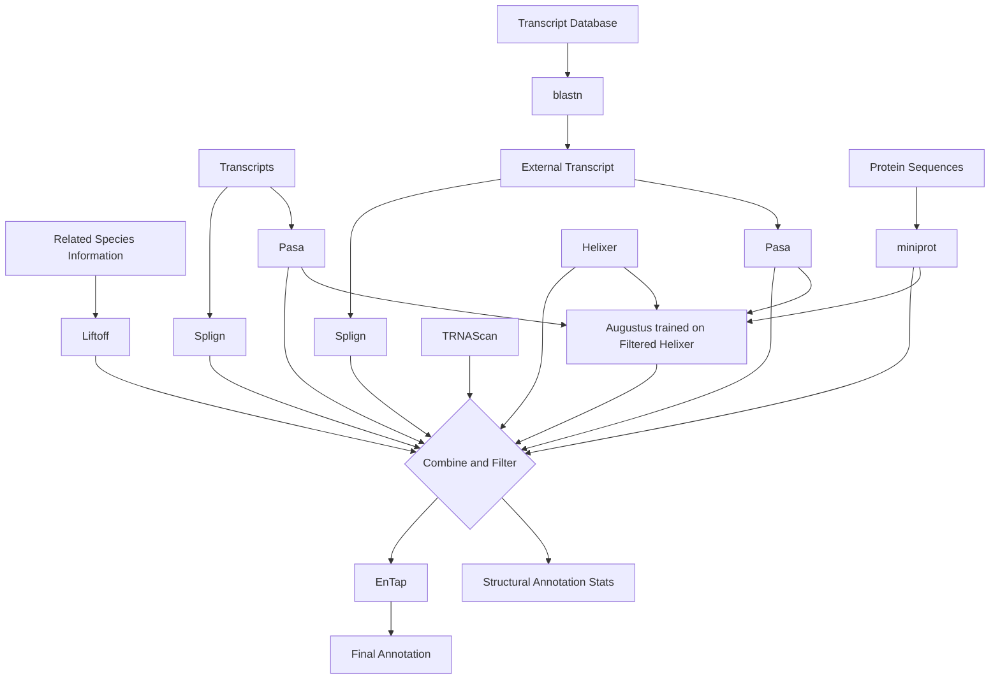
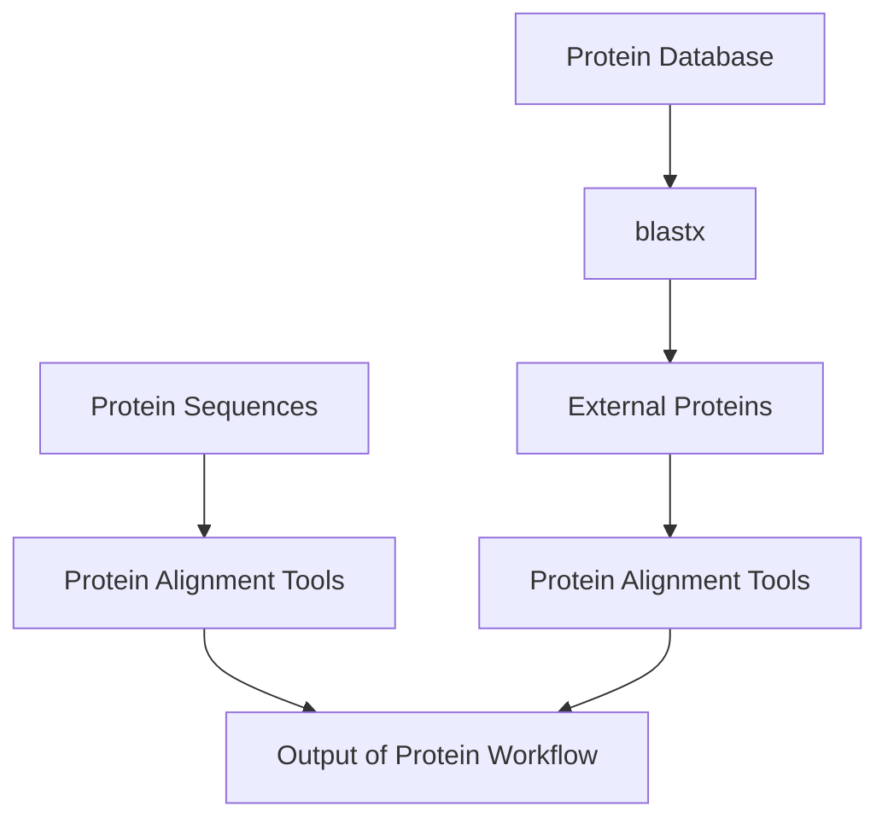
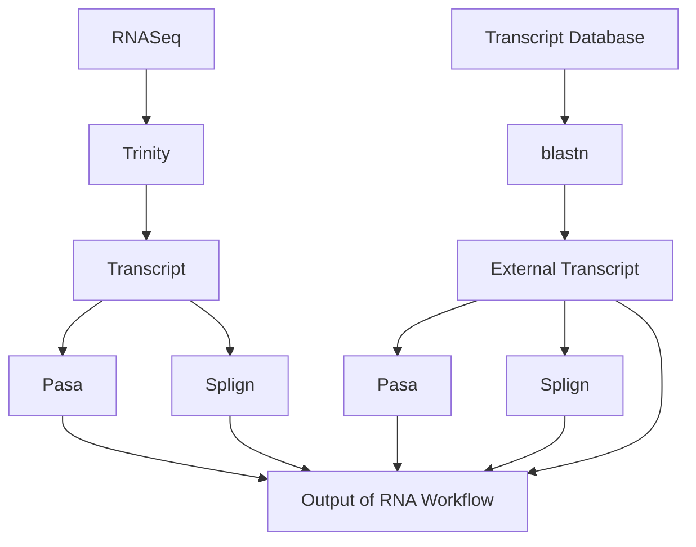
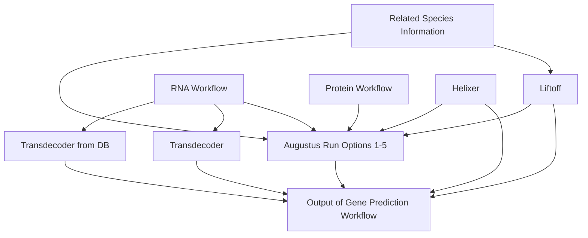
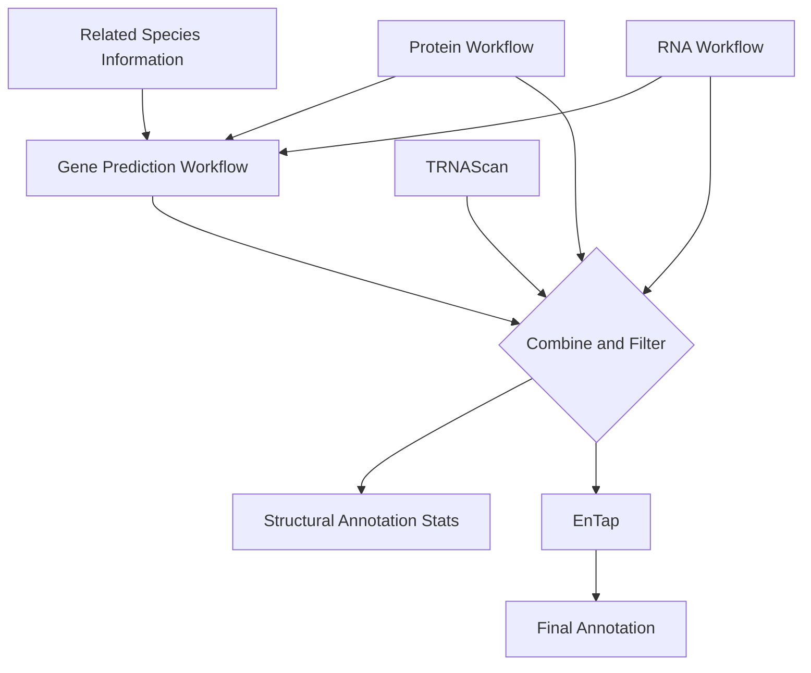

# FLAG (Find Label Annotate Genes)
This is the public repository for FLAG, the Form Bio Genome Annotation Workflow.

## Run options:
The official release of FLAG supports running in either GCP (Google Cloud Platform) or locally, default is local. If running on GCP switch out the modules/nf-modules/nfconf/base.config with modules/nf-modules/nfconf/gcp.config.

## Necessary installs:
1. Docker
2. Nextflow

## Summary

Genome annotation uses computational algorithms to predict the locations
of potential genes and tRNAs, this is called structural annotation. Once
locations are found they are functionally annotated by labeling with
commonly used gene names such as KRT8 and KRAS.

The longest part of this is done in several parallel steps including RNA
transcript to genome alignment, protein to genome alignment, and gene
prediction. Once These parts are done the predicted genes and alignments
are then combined to form a consensus structural annotation. This
structural annotation is then formatted uniformly to be similar to that
of the NCBI and then functionally annotated with Entap.

## Workflow Diagram

The default workflow diagram of FLAG. As the input genome goes into all
steps shown here, except for Trinity, it is left out of the workflow
diagram as to reduce clutter.

To make it easier to understand this workflow can be broken up into 4
smaller workflows:

### 1. Protein Workflow

### 2. RNA Workflow

### 3. Gene Prediction Workflow

### 4. Overall

## Methods

First if the input genome is unmasked then masking is done with
windowmasker[1](#ref-morgulisWindowMaskerWindowbasedMasker2006),
repeat
masker[2](#ref-hubleyRmhubleyRepeatMasker2023), or
repeat
modeler[3](#ref-flynnRepeatModeler2AutomatedGenomic2020)
in conjunction with repeat masker. Then proteins and transcript data are
aligned to the genome in parallel, extra protein or transcript data can
also be pulled from databases at this time with blast. Depending on what
gene predictors are selected gene prediction will be run in parallel or
in series with protein and transcript alignments. After all alignments
and gene predictions are done they are then combined and filtered down
to produce more complete consensus gene predictions and filter out
unlikely predictions. The protein coding annotations are also combined
with tRNA annotations from tRNAScan. Once all annotations are filtered
and combined functional annotation is done with entap, functional
annotation being labeling genes as KRAS, BRCA2, etc. Lastly the
structural and functional annotations are combined into a singular file
and formatted in a gtf format similar to that of the NCBI. After which
annotation statistics are calculated with
AGAT[4](#ref-dainatNBISwedenAGATAGATv12023) and
BUSCO[5](#ref-manniBUSCOUpdateNovel2021). Further
details on methods can be found in the FLAG paper.

## Tips and Tricks

- For most use cases it is recommended to stay as close to the defaults
  as possible.
- If you have a high quality genome assembly and a quick runtime is
  desired Augustus can usually be skipped while running Helixer and
  Liftoff to obtain similar results in almost half the time.
- Related species files, if used, should be of high quality while being
  as closely related as possible to the species of interest. Sometimes
  it may be better to choose a less related species if a species that is
  more closely related has files of poor quality.

## Built With

## FLAG Preprint
The preprint of FLAG can be found at: https://www.biorxiv.org/content/10.1101/2023.07.14.548907v1

## FLAG Citation
When using FLAG please cite:
FLAG: Find, Label Annotate Genomes, a fully automated tool for genome gene structural and functional annotation of highly fragmented non-model species
William Troy, Joana Damas, Alexander J Titus, Brandi L Cantarel
bioRxiv 2023.07.14.548907; doi: https://doi.org/10.1101/2023.07.14.548907

## Citations

1.
Morgulis, A., Gertz, E. M.,
Schäffer, A. A. & Agarwala, R. [WindowMasker: Window-based masker for
sequenced genomes](https://doi.org/10.1093/bioinformatics/bti774).
*Bioinformatics* **22**, 134–141 (2006).

2.
Hubley, R. Rmhubley/RepeatMasker.
(2023).

3.
Flynn, J. M. *et al.*
[RepeatModeler2 for automated genomic discovery of transposable element
families](https://doi.org/10.1073/pnas.1921046117). *Proceedings of the
National Academy of Sciences* **117**, 9451–9457 (2020).

4.
Dainat, J. *et al.*
NBISweden/AGAT: AGAT-v1.1.0. (2023)
doi:[10.5281/zenodo.7950165](https://doi.org/10.5281/zenodo.7950165).

5.
Manni, M., Berkeley, M. R.,
Seppey, M., Simao, F. A. & Zdobnov, E. M. BUSCO update: Novel and
streamlined workflows along with broader and deeper phylogenetic
coverage for scoring of eukaryotic, prokaryotic, and viral genomes.
(2021)
doi:[10.48550/arXiv.2106.11799](https://doi.org/10.48550/arXiv.2106.11799).

